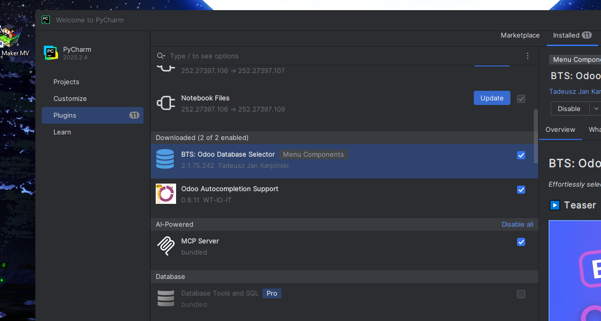
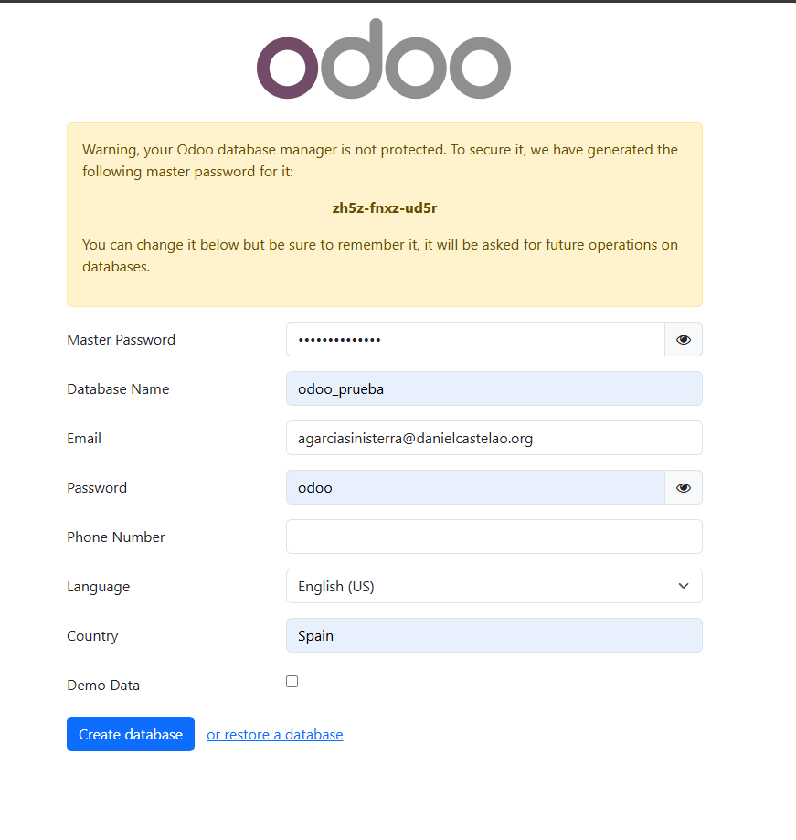
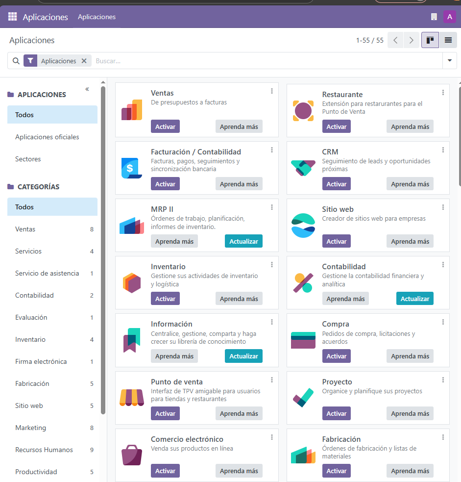
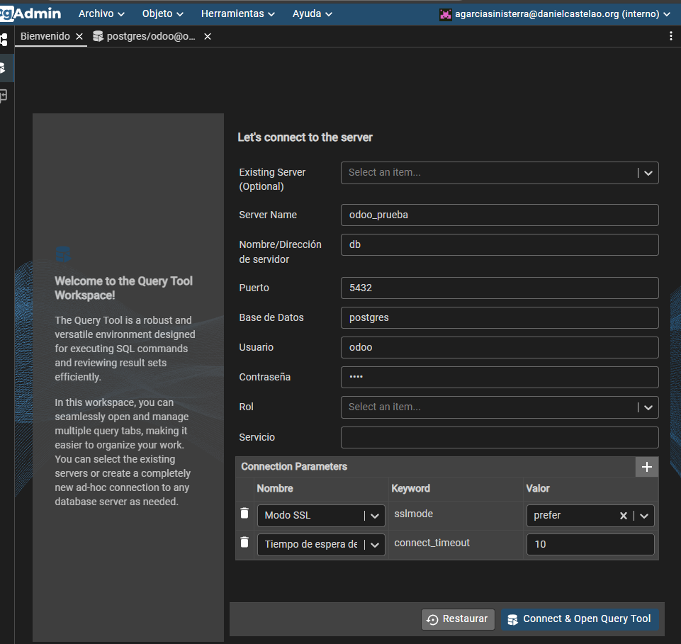
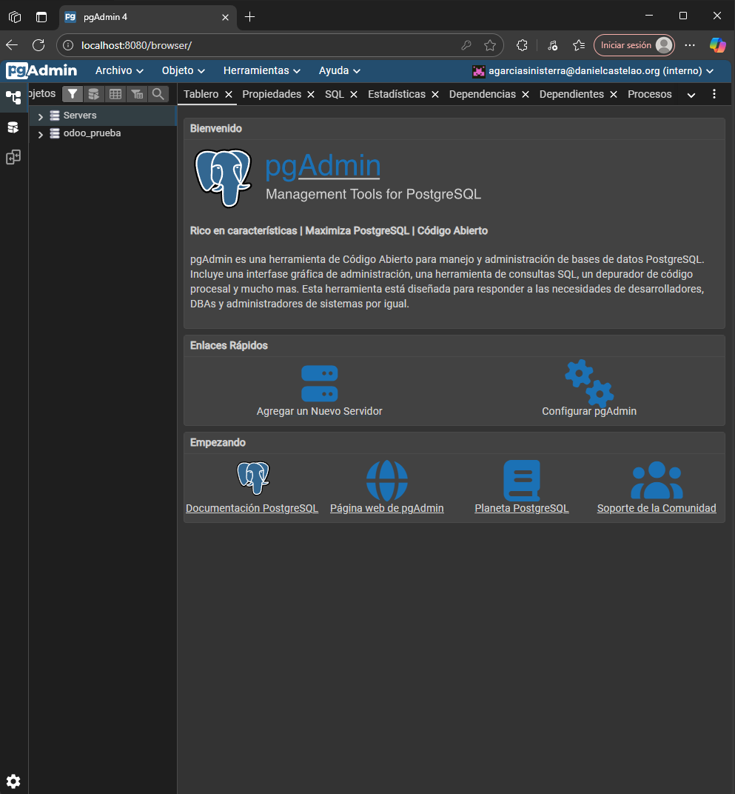
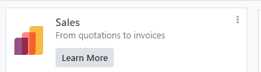
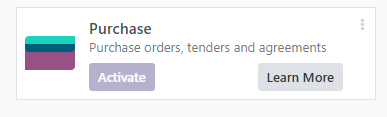
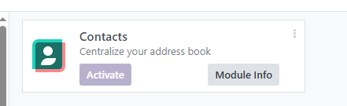
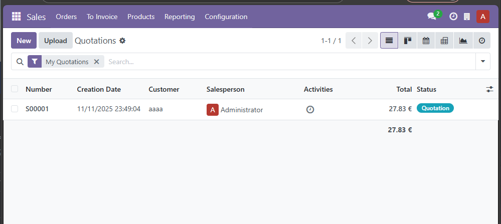
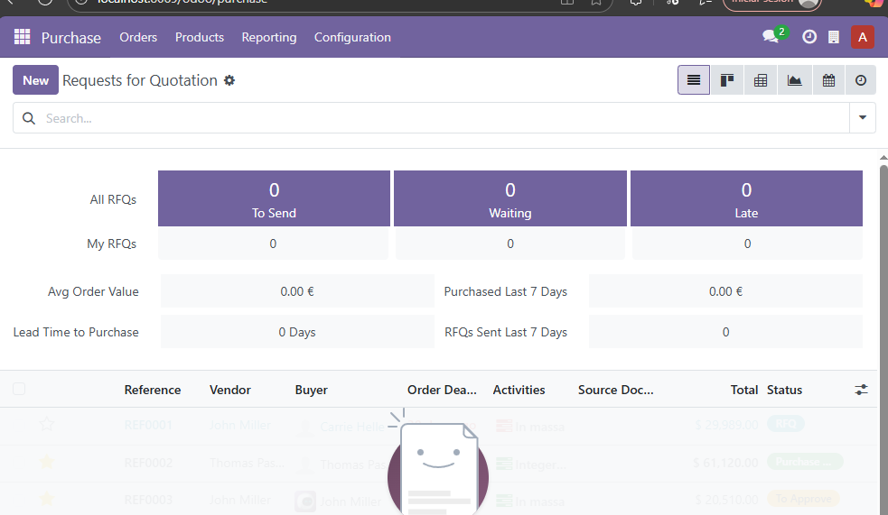

# Tarea11_SXE

## 1. Preparar el IDE

He probado a instalar PyCharm, ya que lo tenemos en los ordenadores de clase. Es un IDE para Python y el tema con GitHub es muy parecido a IntelliJ. Lo he descargado desde [PyCharm Download](https://www.jetbrains.com/pycharm/download/download-thanks.html?platform=windows).

Al instalar PyCharm te pondrá una opción de **Plugins**, donde puedes instalar los que hagan falta. Los esenciales serán **Docker**, **YAML** y **.env files**, pero normalmente ya están instaladas por defecto, aunque está bien actualizarlas.

Decidí instalar **BTS** para cambiar entre bases de datos y **Odoo Autocompletion**.



ejemplo de funcionamiento de bts


---

## 2. Instalar Odoo y PgAdmin

Escribimos el docker-compose.yml:

```
services:
  db:
    image: postgres:17
    environment:
      - POSTGRES_DB=postgres
      - POSTGRES_USER=odoo
      - POSTGRES_PASSWORD=odoo
    volumes:
      - db_data:/var/lib/postgresql/data

  odoo:
    image: odoo:18.0
    depends_on:
      - db
    ports:
      - "8069:8069"
    environment:
      - HOST=db
      - USER=odoo
      - PASSWORD=odoo
    volumes:
      - odoo_data:/var/lib/odoo
      - ./addons:/mnt/extra-addons

  pgadmin:
    image: dpage/pgadmin4
    depends_on:
      - db
    ports:
      - "8080:80"
    environment:
      - PGADMIN_DEFAULT_EMAIL=agarciasinisterra@danielcastelao.org
      - PGADMIN_DEFAULT_PASSWORD=pgadmin
    volumes:
      - pgadmin_data:/var/lib/pgadmin

volumes:
  db_data:
  odoo_data:
  pgadmin_data:
```

### Capturas de Odoo y PgAdmin





Para coger nuestra base de datos de Odoo, entramos en nuestro `localhost` en el puerto que hemos definido y vamos a:

```
/web/database/manager
```

Aquí podemos **exportar nuestra base de datos en formato zip**.  

O si queremos **conectarlos directamente en PgAdmin**, configuramos así:





---

## 3. Explorar Odoo con Datos de Demo

Instalamos los siguientes módulos básicos: **Compra**, **Venta** y **Contactos**.







Cuando entremos, nos podrá dar la opción de hacer un tutorial.  
Esto se ve así porque **no marqué la casilla "Load demonstration data"**, pero si se marca, se crearán automáticamente **contactos, compras y ventas de prueba**.






